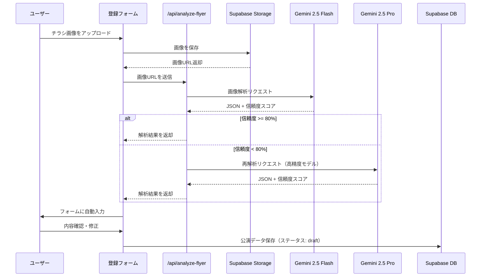
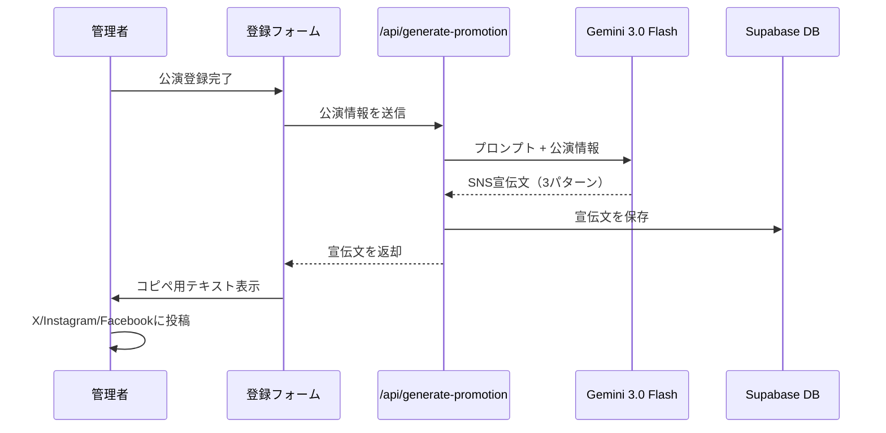
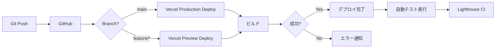
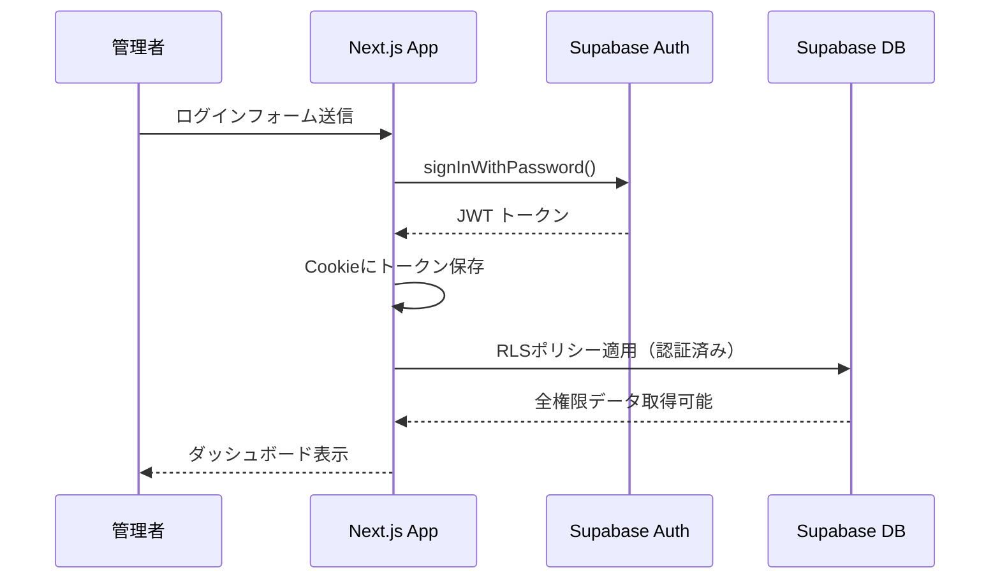

# アーキテクチャ設計書

## 1. システムアーキテクチャ概要

### 1.1 全体構成

```mermaid
graph TB
    Visitor[閲覧ユーザー]
    TheaterUser[劇団ユーザー]
    Admin[運営者]

    subgraph "フロントエンド（Vercel）"
        NextJS[Next.js 15 App Router\n(公開サイト + /theater)]
        TinaCMS[TinaCMS /admin（ブログ・固定ページ）]
    end

    subgraph "バックエンド・API"
        API[Next.js Route Handlers (/api/*)]
        EdgeFn[Supabase Edge Functions（必要に応じて）]
        GeminiAPI[Gemini API]
    end

    subgraph "データ層"
        Auth[Supabase Auth]
        Supabase[(Supabase PostgreSQL)]
        Storage[Supabase Storage]
        GitHub[(GitHub Repository)]
    end

    Visitor --> NextJS
    TheaterUser --> NextJS
    Admin --> TinaCMS

    NextJS --> Auth
    NextJS --> API
    NextJS --> Supabase
    NextJS --> Storage
    TinaCMS --> GitHub
    API --> GeminiAPI
    API --> EdgeFn
    EdgeFn --> Supabase
    API --> Storage
    GitHub -->|Auto Deploy| NextJS
```

### 1.2 技術スタック詳細

| レイヤー | 技術 | 責務 |
|----------|------|------|
| **フロントエンド** | Next.js 15 (App Router) | SSR/SSG、ルーティング、UI |
| **スタイリング** | Tailwind CSS | ユーティリティファーストCSS |
| **UI コンポーネント** | React 19 | コンポーネントベースUI |
| **CMS** | TinaCMS | Git-based コンテンツ管理 |
| **データベース** | Supabase (PostgreSQL) | 劇団・公演データ、PV集計、リダイレクト |
| **認証** | Supabase Auth | 劇団ログイン（Google OAuth + Magic Link）/ 運営者ログイン |
| **ストレージ** | Supabase Storage | チラシ画像、公演画像 |
| **AI - 画像解析** | Gemini 2.5 Flash/Pro | チラシ自動解析 |
| **AI - テキスト生成** | Gemini 3.0 Flash | SNS宣伝文生成 |
| **カレンダー** | FullCalendar | 公演スケジュール表示 |
| **ホスティング** | Vercel | デプロイ、Edge Functions |
| **CDN** | Cloudflare | DNS、CDN |

---

## 2. Next.js App Router ディレクトリ構造

```
fukuoka-stage---night's-coffee/
├── app/
│   ├── layout.tsx                 # ルートレイアウト（ヘッダー、フッター）
│   ├── page.tsx                   # トップページ（/）
│   ├── events/
│   │   ├── page.tsx               # 公演一覧（/events/）
│   │   └── [category]/
│   │       ├── page.tsx           # カテゴリー別公演一覧（/events/[category]/）
│   │       └── [slug]/
│   │           └── page.tsx       # 公演詳細（/events/[category]/[slug]/）
│   ├── blog/
│   │   ├── page.tsx               # ブログ一覧（/blog/）
│   │   └── [slug]/
│   │       └── page.tsx           # ブログ記事詳細（/blog/[slug]/）
│   ├── calendar/
│   │   └── page.tsx               # カレンダーページ（/calendar/）
│   ├── register/
│   │   └── page.tsx               # 劇団ログイン・オンボーディング（/register/）
│   ├── theater/
│   │   ├── layout.tsx             # 劇団ダッシュボード共通（要ログイン）
│   │   ├── page.tsx               # ダッシュボード（/theater/）
│   │   ├── events/
│   │   │   ├── new/
│   │   │   │   └── page.tsx       # 公演新規作成（/theater/events/new/）
│   │   │   └── [id]/
│   │   │       └── page.tsx       # 公演編集（/theater/events/[id]/）
│   │   └── settings/
│   │       └── page.tsx           # 劇団設定（/theater/settings/）
│   ├── about/
│   │   └── page.tsx               # 運営者情報（/about/）
│   ├── contact/
│   │   └── page.tsx               # お問い合わせ（/contact/）
│   ├── privacy-policy/
│   │   └── page.tsx               # プライバシーポリシー（/privacy-policy/）
│   ├── sitemap.ts                 # 動的サイトマップ（/sitemap.xml）
│   ├── robots.ts                  # robots.txt（/robots.txt）
│   ├── api/
│   │   ├── ai/
│   │   │   ├── analyze-flyer/
│   │   │   │   └── route.ts       # チラシ画像解析API
│   │   │   └── generate-promotion/
│   │   │       └── route.ts       # SNS宣伝文生成API
│   │   ├── views/
│   │   │   └── route.ts           # PV計測（直近30日集計用）
│   │   ├── theater/
│   │   │   └── onboard/
│   │   │       └── route.ts       # 劇団情報登録（オンボーディング）
│   │   └── contact/
│   │       └── route.ts           # お問い合わせ送信API
│   ├── admin/
│   │   └── [[...index]]/
│   │       └── page.tsx           # TinaCMS 管理画面（/admin/）
│   └── not-found.tsx              # 404ページ
├── components/
│   ├── ui/
│   │   ├── Header.tsx
│   │   ├── Footer.tsx
│   │   ├── EventCard.tsx
│   │   ├── BlogCard.tsx
│   │   ├── MoodSelector.tsx
│   │   └── CategoryGrid.tsx
│   ├── forms/
│   │   ├── RegisterForm.tsx
│   │   └── ContactForm.tsx
│   └── calendar/
│       └── EventCalendar.tsx
├── lib/
│   ├── supabase/
│   │   ├── client.ts              # Supabase クライアント
│   │   ├── server.ts              # Supabase サーバークライアント
│   │   └── queries.ts             # データベースクエリ
│   ├── gemini/
│   │   ├── flyer-analyzer.ts      # チラシ解析ロジック
│   │   └── promotion-generator.ts # SNS宣伝文生成ロジック
│   ├── tina/
│   │   ├── config.ts              # TinaCMS 設定
│   │   └── schema.ts              # コンテンツスキーマ
│   └── utils/
│       ├── date.ts                # 日付フォーマット
│       └── seo.ts                 # SEOヘルパー
├── content/
│   └── blog/                      # TinaCMS マークダウンファイル
│       ├── post-1.md
│       └── post-2.md
├── public/
│   ├── images/
│   ├── favicon.ico
│   └── robots.txt
├── tina/
│   ├── config.ts                  # TinaCMS ルート設定
│   └── schema.ts
├── .env.local                     # 環境変数
├── next.config.ts
├── tailwind.config.ts
├── tsconfig.json
└── package.json
```

---

## 3. データベース設計（Supabase）

### 3.1 主なテーブル（詳細は `docs/03_database.md`）
- `theaters`, `theater_members`, `admins`: 劇団オンボーディングと承認、権限判定
- `events`: 公演（`/events/[category]/[slug]` 用に `(category, slug)` 一意）
- `event_redirects`: 旧URL→新URLの301マッピング（カテゴリ/slug変更時）
- `event_views_daily`: 直近30日PV集計（人気順/TRENDING用）
- `promotions`: AI生成SNS宣伝文
- `categories`, `venues`: マスタ

### 3.2 RLS 方針（要点）
- 公開公演（`events.status='published'`）は匿名含め閲覧可
- 劇団メンバーは **自劇団のデータのみ** 作成・更新・削除可
- `theaters.status != 'approved'` の劇団は公演を `published` にできない（RLSで制御）
- `event_views_daily` / `event_redirects` は改ざん対策として **service_role** のみ更新（API経由）

---

## 4. TinaCMS 統合

### 4.1 TinaCMS コンテンツスキーマ

```typescript
// tina/schema.ts
export default defineConfig({
  schema: {
    collections: [
      {
        name: "blog",
        label: "Blog Posts",
        path: "content/blog",
        fields: [
          {
            type: "string",
            name: "title",
            label: "Title",
            required: true,
          },
          {
            type: "string",
            name: "slug",
            label: "Slug",
            required: true,
          },
          {
            type: "datetime",
            name: "publishedAt",
            label: "Published At",
          },
          {
            type: "string",
            name: "excerpt",
            label: "Excerpt",
            ui: { component: "textarea" },
          },
          {
            type: "rich-text",
            name: "body",
            label: "Body",
            isBody: true,
          },
          {
            type: "image",
            name: "image",
            label: "Cover Image",
          },
          {
            type: "string",
            name: "category",
            label: "Category",
            options: ["福岡演劇情報", "劇場ガイド", "インタビュー", "レビュー"],
          },
          {
            type: "string",
            name: "tags",
            label: "Tags",
            list: true,
          },
        ],
      },
    ],
  },
});
```

### 4.2 ワークフロー
1. 管理者が `/admin` にアクセス
2. TinaCMS エディタでブログ記事を作成・編集
3. リアルタイムプレビュー確認
4. 「Save」ボタン → GitHub に自動コミット
5. GitHub Webhook → Vercel 自動デプロイ（1-2分）
6. サイトに反映

---

## 5. AI 機能フロー

### 5.1 チラシ画像解析フロー



#### Gemini API リクエスト例（Flash）

```typescript
// lib/gemini/flyer-analyzer.ts
import { GoogleGenerativeAI } from "@google/generative-ai";

const genAI = new GoogleGenerativeAI(process.env.GEMINI_API_KEY!);

export async function analyzeFlyerImage(imageUrl: string) {
  const model = genAI.getGenerativeModel({ model: "gemini-2.5-flash" });

  const prompt = `
このチラシ画像から以下の情報を抽出して、JSON形式で返してください。
各フィールドの信頼度も0-1の範囲で提供してください。

抽出する情報:
- title: 公演タイトル
- company: 劇団名
- dates: 開催日時（YYYY-MM-DD形式）
- venue: 会場名
- price: 料金情報（一般、学生）
- description: あらすじ
- cast: キャスト情報（配列）
- category: カテゴリー（コメディ/会話劇/ミュージカル/etc.）

JSONスキーマ:
{
  "title": "string",
  "company": "string",
  "dates": { "start": "YYYY-MM-DD", "end": "YYYY-MM-DD" },
  "venue": "string",
  "price": { "general": number, "student": number },
  "description": "string",
  "cast": ["string"],
  "category": "string",
  "confidence": number
}
`;

  const result = await model.generateContent([
    {
      inlineData: {
        mimeType: "image/jpeg",
        data: await fetchImageAsBase64(imageUrl),
      },
    },
    { text: prompt },
  ]);

  const jsonResponse = JSON.parse(result.response.text());

  // 信頼度が80%未満ならフォールバック
  if (jsonResponse.confidence < 0.8) {
    return await analyzeWithPro(imageUrl); // Gemini 2.5 Pro で再解析
  }

  return jsonResponse;
}
```

---

### 5.2 SNS宣伝文生成フロー



#### Gemini API リクエスト例（3.0 Flash）

```typescript
// lib/gemini/promotion-generator.ts
import { GoogleGenerativeAI } from "@google/generative-ai";

const genAI = new GoogleGenerativeAI(process.env.GEMINI_API_KEY!);

export async function generatePromotion(eventData: Event) {
  const model = genAI.getGenerativeModel({ model: "gemini-3.0-flash" });

  const prompt = `
以下の公演情報をもとに、SNS投稿用の魅力的な宣伝文を3パターン生成してください。

公演情報:
- タイトル: ${eventData.title}
- 開催日: ${eventData.start_date} 〜 ${eventData.end_date}
- 会場: ${eventData.venue}
- 料金: ${eventData.price_general}円
- カテゴリー: ${eventData.category}
- あらすじ: ${eventData.description}
- 劇団: ${eventData.company}

URL: https://fukuoka-stage.com/events/${eventData.slug}

要件:
1. X/Twitter用（140文字以内、絵文字使用、ハッシュタグ5つ）
2. Instagram用（2200文字以内、改行・絵文字で読みやすく、ハッシュタグ10個）
3. Facebook用（300文字程度、フォーマル、リンク強調）

各SNSの特性に合わせて、読者が「行きたい！」と思える文章にしてください。
`;

  const result = await model.generateContent(prompt);

  return {
    twitter: extractTwitterText(result.response.text()),
    instagram: extractInstagramText(result.response.text()),
    facebook: extractFacebookText(result.response.text()),
  };
}
```

---

## 6. デプロイ構成

### 6.1 環境構成

| 環境 | URL | 用途 |
|------|-----|------|
| **Production** | `https://fukuoka-stage.com` | 本番環境（Vercel） |
| **Preview** | `https://fukuoka-stage-*.vercel.app` | PR毎のプレビュー環境 |
| **Development** | `http://localhost:3000` | ローカル開発環境 |

### 6.2 環境変数

```bash
# .env.local（ローカル開発）
NEXT_PUBLIC_SUPABASE_URL=https://xxx.supabase.co
NEXT_PUBLIC_SUPABASE_ANON_KEY=eyJxxx...
SUPABASE_SERVICE_ROLE_KEY=eyJxxx...

GEMINI_API_KEY=AIzaSyxxx...

TINA_TOKEN=xxx...
NEXT_PUBLIC_TINA_CLIENT_ID=xxx...

NEXT_PUBLIC_SITE_URL=http://localhost:3000
```

**Vercel 環境変数設定**:
- Production: 本番用Supabase、Gemini API キー
- Preview: 開発用Supabase、同じGemini API キー（テスト用）

### 6.3 CI/CD パイプライン



---

## 7. セキュリティアーキテクチャ

### 7.1 認証フロー（Supabase Auth）



### 7.2 API セキュリティ

#### Rate Limiting（Vercel Edge Middleware）
```typescript
// middleware.ts
import { NextResponse } from 'next/server';
import type { NextRequest } from 'next/server';
import { Ratelimit } from '@upstash/ratelimit';
import { Redis } from '@upstash/redis';

const ratelimit = new Ratelimit({
  redis: Redis.fromEnv(),
  limiter: Ratelimit.slidingWindow(10, '1 m'), // 10リクエスト/分
});

export async function middleware(request: NextRequest) {
  if (request.nextUrl.pathname.startsWith('/api/analyze-flyer')) {
    const ip = request.ip ?? '127.0.0.1';
    const { success } = await ratelimit.limit(ip);

    if (!success) {
      return NextResponse.json(
        { error: 'Rate limit exceeded' },
        { status: 429 }
      );
    }
  }

  return NextResponse.next();
}
```

---

## 8. パフォーマンス最適化

### 8.1 レンダリング戦略

| ページ | レンダリング戦略 | 理由 |
|--------|------------------|------|
| トップページ | **SSR** | 常に最新の公演情報を表示 |
| 公演一覧 | **SSR** | SEO重視、リアルタイム更新 |
| 公演詳細 | **SSG + ISR（60秒）** | SEO最適化、キャッシュ効率化 |
| ブログ一覧 | **SSG + ISR（300秒）** | 静的生成で高速化 |
| ブログ詳細 | **SSG + ISR（300秒）** | 静的生成で高速化 |
| カレンダー | **CSR** | クライアント側で動的表示 |
| 劇団ログイン/オンボーディング | **CSR** | 認証、フォーム送信 |
| 劇団ダッシュボード | **CSR** | フォーム中心、権限付き操作 |

**ISR（Incremental Static Regeneration）**:
```typescript
// app/events/[category]/[slug]/page.tsx
export const revalidate = 60; // 60秒ごとに再生成

export async function generateStaticParams() {
  const events = await getPublishedEvents();
  return events.map((event) => ({ category: event.category, slug: event.slug }));
}
```

### 8.2 画像最適化

```typescript
// components/ui/EventCard.tsx
import Image from 'next/image';

<Image
  src={event.image_url}
  alt={event.title}
  width={600}
  height={400}
  loading="lazy"
  placeholder="blur"
  blurDataURL="/placeholder.jpg"
  sizes="(max-width: 768px) 100vw, (max-width: 1024px) 50vw, 33vw"
/>
```

---

## 9. 技術的決定事項（ADR）

### 9.1 なぜ Next.js を選んだのか？
- **SEO最適化**: SSR/SSGでGoogle検索に最適
- **パフォーマンス**: Image Optimization、Code Splitting自動化
- **開発体験**: App Router、TypeScript、ホットリロード
- **エコシステム**: Vercel、TinaCMS との統合が簡単

### 9.2 なぜ Supabase を選んだのか？
- **無料プラン**: 500MB DB、1GB ストレージ（初期は十分）
- **Row Level Security**: データベースレベルのセキュリティ
- **リアルタイムAPI**: 将来的な拡張性
- **認証**: Supabase Auth でシンプルな実装
- **PostgreSQL**: 信頼性の高いRDBMS

### 9.3 なぜ TinaCMS を選んだのか？
- **Git-based**: コンテンツがバージョン管理される
- **WordPress風UI**: `/admin`で直感的な編集
- **無料プラン**: 2ユーザーまで無料
- **Next.js統合**: 公式サポート、設定が簡単

### 9.4 なぜ Gemini API を選んだのか？
- **高精度**: Gemini 2.5 Flash で90-95%精度（チラシ解析）
- **コスパ**: Flash は ¥0.05-0.1/画像（GPT-4o Vision の1/15）
- **ハイブリッド戦略**: Flash → Pro フォールバックで精度担保
- **テキスト生成**: Gemini 3.0 Flash でSNS宣伝文も高品質

---

**作成日**: 2026-01-31  
**最終更新日**: 2026-01-31  
**バージョン**: 2.0  
**作成者**: Claude Code (AI Assistant)
