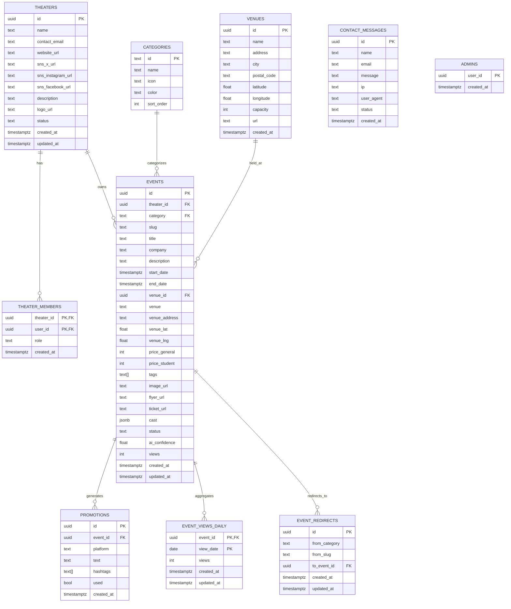

# データベース設計書

## 1. データベース概要

### 1.1 基本情報
- **DBMS**: PostgreSQL 15.x（Supabase）
- **文字コード**: UTF-8
- **タイムゾーン**: Asia/Tokyo (JST)
- **接続方式**: Supabase Client SDK、Row Level Security (RLS)

### 1.2 本書の前提（要件との対応）
- ブログ/固定ページは **TinaCMS（Git管理）** を利用し、DBには保持しない（公演・劇団データはDBで管理）
- 公演の承認フローは **無し**（劇団が作成・編集・削除できる）
- ただし **劇団アカウントの承認** は存在し、未承認の劇団は公演を **公開（published）できない**
- 人気順（PV）は **直近30日PV** を指標とするため、DBで日次集計を保持する
- 公演URLは `/events/[category]/[slug]`（カテゴリ/slug変更時は 301 リダイレクトを作成）

---

## 2. テーブル一覧

| テーブル名 | 説明 | レコード数想定 |
|------------|------|----------------|
| `categories` | カテゴリーマスタ | 10件（固定） |
| `venues` | 会場マスタ | 20-100件 |
| `theaters` | 劇団（承認状態を含む） | 50-300件 |
| `theater_members` | 劇団メンバー（auth.usersとの紐づけ） | theaters × 1-10 |
| `admins` | 運営者アカウント | 数名 |
| `events` | 公演情報 | 100-500件/年 |
| `event_redirects` | 旧URL→現行公演の301マッピング | 公演更新に応じて増加 |
| `event_views_daily` | 公演の日次PV集計 | events × 日数 |
| `promotions` | AI生成SNS宣伝文 | events × 3（SNS種類） |
| `contact_messages` | お問い合わせ | 100-1000件/年 |

---

## 3. ER図



---

## 4. テーブル定義詳細

### 4.1 `admins` テーブル（運営者）

運営者権限をDB側で判定するための最小テーブル。

| カラム名 | 型 | NULL | デフォルト | 制約 | 説明 |
|----------|-------|------|------------|------|------|
| `user_id` | UUID | NO | - | PRIMARY KEY（auth.users参照） | Supabase AuthユーザーID |
| `created_at` | TIMESTAMPTZ | NO | `NOW()` | | 登録日時 |

---

### 4.2 `theaters` テーブル（劇団）

| カラム名 | 型 | NULL | デフォルト | 制約 | 説明 |
|----------|-------|------|------------|------|------|
| `id` | UUID | NO | `gen_random_uuid()` | PRIMARY KEY | 劇団ID |
| `name` | TEXT | NO | - | | 劇団名 |
| `contact_email` | TEXT | NO | - | | 連絡先メール |
| `website_url` | TEXT | YES | NULL | | 公式サイトURL |
| `sns_x_url` | TEXT | YES | NULL | | X URL |
| `sns_instagram_url` | TEXT | YES | NULL | | Instagram URL |
| `sns_facebook_url` | TEXT | YES | NULL | | Facebook URL |
| `description` | TEXT | YES | NULL | | 紹介文 |
| `logo_url` | TEXT | YES | NULL | | ロゴ画像URL（Storage） |
| `status` | TEXT | NO | `'pending'` | CHECK | 承認状態（`pending`, `approved`, `rejected`, `suspended`） |
| `created_at` | TIMESTAMPTZ | NO | `NOW()` | | 作成日時 |
| `updated_at` | TIMESTAMPTZ | NO | `NOW()` | | 更新日時（トリガーで自動更新） |

**インデックス**:
```sql
CREATE INDEX idx_theaters_status ON theaters(status);
```

---

### 4.3 `theater_members` テーブル（劇団メンバー）

| カラム名 | 型 | NULL | デフォルト | 制約 | 説明 |
|----------|-------|------|------------|------|------|
| `theater_id` | UUID | NO | - | PK, FK → theaters.id | 劇団ID |
| `user_id` | UUID | NO | - | PK（auth.users参照） | ユーザーID |
| `role` | TEXT | NO | `'owner'` | CHECK | 権限（`owner`, `editor`） |
| `created_at` | TIMESTAMPTZ | NO | `NOW()` | | 登録日時 |

**インデックス**:
```sql
CREATE INDEX idx_theater_members_user_id ON theater_members(user_id);
```

---

### 4.4 `categories` テーブル（カテゴリーマスタ）

| カラム名 | 型 | NULL | デフォルト | 制約 | 説明 |
|----------|-------|------|------------|------|------|
| `id` | TEXT | NO | - | PRIMARY KEY | カテゴリーID（例: `comedy`） |
| `name` | TEXT | NO | - | | カテゴリー名（例: `コメディ`） |
| `icon` | TEXT | YES | NULL | | アイコン名（Emoji or SVG名） |
| `color` | TEXT | YES | NULL | | カラーコード（例: `#FFD93D`） |
| `description` | TEXT | YES | NULL | | 説明文 |
| `sort_order` | INTEGER | NO | 0 | | 表示順序 |

#### 初期データ
```sql
INSERT INTO categories (id, name, icon, color, sort_order) VALUES
  ('comedy', 'コメディ', '😂', '#FFD93D', 1),
  ('conversation', '会話劇', '💬', '#FF6B9D', 2),
  ('musical', 'ミュージカル', '🎵', '#A78BFA', 3),
  ('classic', '古典・時代劇', '🏯', '#6BCF7F', 4),
  ('dance', 'ダンス', '💃', '#4ECDC4', 5),
  ('student', '学生演劇', '🎓', '#FFB74D', 6),
  ('conte', 'コント', '🎭', '#FF8A80', 7),
  ('experimental', '実験的', '🔬', '#B39DDB', 8),
  ('other', 'その他', '📌', '#90A4AE', 99);
```

---

### 4.5 `venues` テーブル（会場マスタ）

| カラム名 | 型 | NULL | デフォルト | 制約 | 説明 |
|----------|-------|------|------------|------|------|
| `id` | UUID | NO | `gen_random_uuid()` | PRIMARY KEY | 会場ID |
| `name` | TEXT | NO | - | | 会場名 |
| `address` | TEXT | YES | NULL | | 住所 |
| `city` | TEXT | NO | `'福岡市'` | | 市区町村 |
| `postal_code` | TEXT | YES | NULL | | 郵便番号 |
| `latitude` | FLOAT | YES | NULL | | 緯度 |
| `longitude` | FLOAT | YES | NULL | | 経度 |
| `capacity` | INTEGER | YES | NULL | | 収容人数 |
| `url` | TEXT | YES | NULL | | 公式サイトURL |
| `created_at` | TIMESTAMPTZ | NO | `NOW()` | | 作成日時 |

---

### 4.6 `events` テーブル（公演情報）

#### カラム定義
| カラム名 | 型 | NULL | デフォルト | 制約 | 説明 |
|----------|-------|------|------------|------|------|
| `id` | UUID | NO | `gen_random_uuid()` | PRIMARY KEY | 公演ID |
| `theater_id` | UUID | NO | - | FK → theaters.id | 劇団ID（RLSの所有権判定に使用） |
| `category` | TEXT | NO | `'other'` | FK → categories.id | カテゴリーID（URLに使用） |
| `slug` | TEXT | NO | - | UNIQUE（複合） | URL用スラッグ |
| `title` | TEXT | NO | - | | 公演タイトル |
| `company` | TEXT | NO | - | | 劇団名（表示用、theaters.nameのスナップショット） |
| `description` | TEXT | YES | NULL | | あらすじ（1000文字程度） |
| `start_date` | TIMESTAMPTZ | NO | - | | 開始日時（タイムゾーン付き） |
| `end_date` | TIMESTAMPTZ | YES | NULL | | 終了日時（単日公演の場合NULL） |
| `venue_id` | UUID | YES | NULL | FK → venues.id | 会場マスタ参照（任意） |
| `venue` | TEXT | YES | NULL | | 会場名（表示用、任意） |
| `venue_address` | TEXT | YES | NULL | | 会場住所 |
| `venue_lat` | FLOAT | YES | NULL | | 会場緯度（Googleマップ用） |
| `venue_lng` | FLOAT | YES | NULL | | 会場経度（Googleマップ用） |
| `price_general` | INTEGER | YES | NULL | | 一般料金（円） |
| `price_student` | INTEGER | YES | NULL | | 学生料金（円） |
| `tags` | TEXT[] | YES | `'{}'` | | タグ配列（例: `{"笑い度98%", "学生歓迎"}`） |
| `image_url` | TEXT | YES | NULL | | メインビジュアルURL（Storage） |
| `flyer_url` | TEXT | YES | NULL | | チラシ画像URL（Storage） |
| `ticket_url` | TEXT | YES | NULL | | チケット購入URL（外部サイト） |
| `cast` | JSONB | YES | `'[]'` | | キャスト情報（JSON配列）※SQLでは予約語のため `"cast"` で定義 |
| `status` | TEXT | NO | `'draft'` | CHECK | ステータス（`draft`, `published`, `archived`） |
| `ai_confidence` | FLOAT | YES | NULL | CHECK (0 <= ai_confidence <= 1) | AI解析信頼度スコア（0-1） |
| `views` | INTEGER | NO | 0 | | 総PV（内部指標） |
| `created_at` | TIMESTAMPTZ | NO | `NOW()` | | 作成日時 |
| `updated_at` | TIMESTAMPTZ | NO | `NOW()` | | 更新日時（トリガーで自動更新） |

#### 一意性（URL）
URLが `/events/[category]/[slug]` のため、以下を満たす必要がある：
- `UNIQUE(category, slug)`

```sql
CREATE UNIQUE INDEX uniq_events_category_slug ON events(category, slug);
```

#### インデックス
```sql
CREATE INDEX idx_events_theater_id ON events(theater_id);
CREATE INDEX idx_events_status ON events(status);
CREATE INDEX idx_events_start_date ON events(start_date);
CREATE INDEX idx_events_category ON events(category);
```

#### `cast` JSONB 構造例
```json
[
  { "name": "山田太郎", "role": "主人公", "image_url": "https://..." },
  { "name": "佐藤花子", "role": "ヒロイン", "image_url": "https://..." }
]
```

---

### 4.7 `event_redirects` テーブル（301リダイレクト）

カテゴリ/slug変更時に、旧URL→新URLへの301を実現するためのマッピング。

| カラム名 | 型 | NULL | デフォルト | 制約 | 説明 |
|----------|-------|------|------------|------|------|
| `id` | UUID | NO | `gen_random_uuid()` | PRIMARY KEY | リダイレクトID |
| `from_category` | TEXT | NO | - | | 旧カテゴリ |
| `from_slug` | TEXT | NO | - | | 旧スラッグ |
| `to_event_id` | UUID | YES | NULL | FK → events.id | 転送先の公演（削除時はNULLになり得る） |
| `created_at` | TIMESTAMPTZ | NO | `NOW()` | | 作成日時 |
| `updated_at` | TIMESTAMPTZ | NO | `NOW()` | | 更新日時（トリガーで自動更新） |

```sql
CREATE UNIQUE INDEX uniq_event_redirects_from ON event_redirects(from_category, from_slug);
CREATE INDEX idx_event_redirects_to_event_id ON event_redirects(to_event_id);
```

---

### 4.8 `event_views_daily` テーブル（日次PV集計）

直近30日PVのため、日次で集計を保持する（表示・並び替え用）。

| カラム名 | 型 | NULL | デフォルト | 制約 | 説明 |
|----------|-------|------|------------|------|------|
| `event_id` | UUID | NO | - | PK, FK → events.id | 公演ID |
| `view_date` | DATE | NO | - | PK | 集計日（JST日付） |
| `views` | INTEGER | NO | 0 | CHECK (views >= 0) | 当日PV |
| `created_at` | TIMESTAMPTZ | NO | `NOW()` | | 作成日時 |
| `updated_at` | TIMESTAMPTZ | NO | `NOW()` | | 更新日時（トリガーで自動更新） |

```sql
CREATE INDEX idx_event_views_daily_view_date ON event_views_daily(view_date);
```

---

### 4.9 `promotions` テーブル（AI生成SNS宣伝文）

| カラム名 | 型 | NULL | デフォルト | 制約 | 説明 |
|----------|-------|------|------------|------|------|
| `id` | UUID | NO | `gen_random_uuid()` | PRIMARY KEY | 宣伝文ID |
| `event_id` | UUID | NO | - | FK → events.id | 公演ID |
| `platform` | TEXT | NO | - | CHECK | SNS（`twitter`, `instagram`, `facebook`） |
| `text` | TEXT | NO | - | | 宣伝文 |
| `hashtags` | TEXT[] | YES | `'{}'` | | ハッシュタグ配列 |
| `used` | BOOLEAN | NO | FALSE | | 使用済みフラグ |
| `created_at` | TIMESTAMPTZ | NO | `NOW()` | | 作成日時 |

---

### 4.10 `contact_messages` テーブル（お問い合わせ）

| カラム名 | 型 | NULL | デフォルト | 制約 | 説明 |
|----------|-------|------|------------|------|------|
| `id` | UUID | NO | `gen_random_uuid()` | PRIMARY KEY | ID |
| `name` | TEXT | NO | - | | お名前 |
| `email` | TEXT | NO | - | | メールアドレス |
| `message` | TEXT | NO | - | | お問い合わせ内容 |
| `ip` | TEXT | YES | NULL | | 送信元IP |
| `user_agent` | TEXT | YES | NULL | | User-Agent |
| `status` | TEXT | NO | `'new'` | CHECK | new / read / archived |
| `created_at` | TIMESTAMPTZ | NO | `NOW()` | | 作成日時 |

---

## 5. マイグレーション（例）

### 5.1 初期セットアップ（例）

```sql
-- supabase/migrations/001_initial_schema.sql

CREATE EXTENSION IF NOT EXISTS "uuid-ossp";

-- 運営者
CREATE TABLE admins (
  user_id UUID PRIMARY KEY,
  created_at TIMESTAMPTZ NOT NULL DEFAULT NOW()
);

-- カテゴリ
CREATE TABLE categories (
  id TEXT PRIMARY KEY,
  name TEXT NOT NULL,
  icon TEXT,
  color TEXT,
  description TEXT,
  sort_order INTEGER NOT NULL DEFAULT 0
);

-- 会場
CREATE TABLE venues (
  id UUID PRIMARY KEY DEFAULT gen_random_uuid(),
  name TEXT NOT NULL,
  address TEXT,
  city TEXT NOT NULL DEFAULT '福岡市',
  postal_code TEXT,
  latitude FLOAT,
  longitude FLOAT,
  capacity INTEGER,
  url TEXT,
  created_at TIMESTAMPTZ NOT NULL DEFAULT NOW()
);

-- 劇団
CREATE TABLE theaters (
  id UUID PRIMARY KEY DEFAULT gen_random_uuid(),
  name TEXT NOT NULL,
  contact_email TEXT NOT NULL,
  website_url TEXT,
  sns_x_url TEXT,
  sns_instagram_url TEXT,
  sns_facebook_url TEXT,
  description TEXT,
  logo_url TEXT,
  status TEXT NOT NULL DEFAULT 'pending' CHECK (status IN ('pending', 'approved', 'rejected', 'suspended')),
  created_at TIMESTAMPTZ NOT NULL DEFAULT NOW(),
  updated_at TIMESTAMPTZ NOT NULL DEFAULT NOW()
);

CREATE INDEX idx_theaters_status ON theaters(status);

-- 劇団メンバー
CREATE TABLE theater_members (
  theater_id UUID NOT NULL REFERENCES theaters(id) ON DELETE CASCADE,
  user_id UUID NOT NULL,
  role TEXT NOT NULL DEFAULT 'owner' CHECK (role IN ('owner', 'editor')),
  created_at TIMESTAMPTZ NOT NULL DEFAULT NOW(),
  PRIMARY KEY (theater_id, user_id)
);

CREATE INDEX idx_theater_members_user_id ON theater_members(user_id);

-- 公演
CREATE TABLE events (
  id UUID PRIMARY KEY DEFAULT gen_random_uuid(),
  theater_id UUID NOT NULL REFERENCES theaters(id) ON DELETE CASCADE,
  category TEXT NOT NULL DEFAULT 'other' REFERENCES categories(id),
  slug TEXT NOT NULL,
  title TEXT NOT NULL,
  company TEXT NOT NULL,
  description TEXT,
  start_date TIMESTAMPTZ NOT NULL,
  end_date TIMESTAMPTZ,
  venue_id UUID REFERENCES venues(id) ON DELETE SET NULL,
  venue TEXT,
  venue_address TEXT,
  venue_lat FLOAT,
  venue_lng FLOAT,
  price_general INTEGER,
  price_student INTEGER,
  tags TEXT[] DEFAULT '{}',
  image_url TEXT,
  flyer_url TEXT,
  ticket_url TEXT,
  "cast" JSONB DEFAULT '[]',
  status TEXT NOT NULL DEFAULT 'draft' CHECK (status IN ('draft', 'published', 'archived')),
  ai_confidence FLOAT CHECK (ai_confidence >= 0 AND ai_confidence <= 1),
  views INTEGER NOT NULL DEFAULT 0,
  created_at TIMESTAMPTZ NOT NULL DEFAULT NOW(),
  updated_at TIMESTAMPTZ NOT NULL DEFAULT NOW()
);

CREATE UNIQUE INDEX uniq_events_category_slug ON events(category, slug);
CREATE INDEX idx_events_theater_id ON events(theater_id);
CREATE INDEX idx_events_status ON events(status);
CREATE INDEX idx_events_start_date ON events(start_date);
CREATE INDEX idx_events_category ON events(category);

-- 301リダイレクト
CREATE TABLE event_redirects (
  id UUID PRIMARY KEY DEFAULT gen_random_uuid(),
  from_category TEXT NOT NULL,
  from_slug TEXT NOT NULL,
  to_event_id UUID REFERENCES events(id) ON DELETE SET NULL,
  created_at TIMESTAMPTZ NOT NULL DEFAULT NOW(),
  updated_at TIMESTAMPTZ NOT NULL DEFAULT NOW()
);

CREATE UNIQUE INDEX uniq_event_redirects_from ON event_redirects(from_category, from_slug);
CREATE INDEX idx_event_redirects_to_event_id ON event_redirects(to_event_id);

-- 日次PV集計
CREATE TABLE event_views_daily (
  event_id UUID NOT NULL REFERENCES events(id) ON DELETE CASCADE,
  view_date DATE NOT NULL,
  views INTEGER NOT NULL DEFAULT 0 CHECK (views >= 0),
  created_at TIMESTAMPTZ NOT NULL DEFAULT NOW(),
  updated_at TIMESTAMPTZ NOT NULL DEFAULT NOW(),
  PRIMARY KEY (event_id, view_date)
);

CREATE INDEX idx_event_views_daily_view_date ON event_views_daily(view_date);

-- SNS宣伝文
CREATE TABLE promotions (
  id UUID PRIMARY KEY DEFAULT gen_random_uuid(),
  event_id UUID NOT NULL REFERENCES events(id) ON DELETE CASCADE,
  platform TEXT NOT NULL CHECK (platform IN ('twitter', 'instagram', 'facebook')),
  text TEXT NOT NULL,
  hashtags TEXT[] DEFAULT '{}',
  used BOOLEAN NOT NULL DEFAULT FALSE,
  created_at TIMESTAMPTZ NOT NULL DEFAULT NOW()
);

CREATE INDEX idx_promotions_event_id ON promotions(event_id);
CREATE INDEX idx_promotions_platform ON promotions(platform);
```

### 5.2 `updated_at` 自動更新トリガー（例）

```sql
-- supabase/migrations/002_updated_at_trigger.sql

CREATE OR REPLACE FUNCTION update_updated_at_column()
RETURNS TRIGGER AS $$
BEGIN
  NEW.updated_at = NOW();
  RETURN NEW;
END;
$$ LANGUAGE plpgsql;

CREATE TRIGGER update_theaters_updated_at
BEFORE UPDATE ON theaters
FOR EACH ROW
EXECUTE FUNCTION update_updated_at_column();

CREATE TRIGGER update_events_updated_at
BEFORE UPDATE ON events
FOR EACH ROW
EXECUTE FUNCTION update_updated_at_column();

CREATE TRIGGER update_event_redirects_updated_at
BEFORE UPDATE ON event_redirects
FOR EACH ROW
EXECUTE FUNCTION update_updated_at_column();

CREATE TRIGGER update_event_views_daily_updated_at
BEFORE UPDATE ON event_views_daily
FOR EACH ROW
EXECUTE FUNCTION update_updated_at_column();
```

### 5.3 検索（日本語の部分一致/類似検索）※任意

```sql
-- supabase/migrations/003_search.sql
CREATE EXTENSION IF NOT EXISTS pg_trgm;

CREATE INDEX idx_events_title_trgm ON events USING gin (title gin_trgm_ops);
CREATE INDEX idx_events_company_trgm ON events USING gin (company gin_trgm_ops);
CREATE INDEX idx_events_description_trgm ON events USING gin (description gin_trgm_ops);
```

---

## 6. Row Level Security (RLS) 方針

### 6.1 ヘルパー関数（推奨）

```sql
CREATE OR REPLACE FUNCTION is_admin()
RETURNS boolean
LANGUAGE sql
STABLE
AS $$
  SELECT EXISTS (SELECT 1 FROM admins WHERE user_id = auth.uid());
$$;

CREATE OR REPLACE FUNCTION is_theater_member(target_theater_id uuid)
RETURNS boolean
LANGUAGE sql
STABLE
AS $$
  SELECT EXISTS (
    SELECT 1
    FROM theater_members m
    WHERE m.theater_id = target_theater_id
      AND m.user_id = auth.uid()
  );
$$;
```

### 6.1.1 `admins`（運営者）

`admins` は運営者判定に使う内部テーブル。基本はDB管理者が手動で追加する。

```sql
ALTER TABLE admins ENABLE ROW LEVEL SECURITY;

-- 自分自身の行だけ参照可能（= is_admin() 判定が成立する）
CREATE POLICY "Admins row is viewable by self"
ON admins FOR SELECT
TO authenticated
USING (user_id = auth.uid());

-- 変更は service_role のみ（手動運用でも可）
CREATE POLICY "Service role can manage admins"
ON admins FOR ALL
TO service_role
USING (true)
WITH CHECK (true);
```

### 6.2 `theaters`（劇団）

```sql
ALTER TABLE theaters ENABLE ROW LEVEL SECURITY;

-- 運営者は全件参照
CREATE POLICY "Admins can view all theaters"
ON theaters FOR SELECT
USING (is_admin());

-- 劇団メンバーは自劇団のみ参照
CREATE POLICY "Theater members can view their theater"
ON theaters FOR SELECT
USING (EXISTS (
  SELECT 1 FROM theater_members m
  WHERE m.theater_id = theaters.id
    AND m.user_id = auth.uid()
));

-- 劇団作成は認証済みのみ（statusはpending固定）
CREATE POLICY "Authenticated users can create theater as pending"
ON theaters FOR INSERT
TO authenticated
WITH CHECK (status = 'pending');

-- 劇団プロフィール編集（status変更はトリガーで別途ブロック推奨）
CREATE POLICY "Theater members can update their theater"
ON theaters FOR UPDATE
TO authenticated
USING (is_theater_member(id) OR is_admin())
WITH CHECK (is_theater_member(id) OR is_admin());
```

**補足（強く推奨）**: `theaters.status` は運営者のみ変更できるよう、トリガーで強制する。

```sql
CREATE OR REPLACE FUNCTION prevent_theater_status_update()
RETURNS TRIGGER AS $$
BEGIN
  IF NEW.status <> OLD.status THEN
    IF is_admin() OR auth.role() = 'service_role' THEN
      RETURN NEW;
    END IF;
    RAISE EXCEPTION 'Only admin can change theater status';
  END IF;
  RETURN NEW;
END;
$$ LANGUAGE plpgsql;

CREATE TRIGGER trg_prevent_theater_status_update
BEFORE UPDATE ON theaters
FOR EACH ROW
EXECUTE FUNCTION prevent_theater_status_update();
```

### 6.3 `theater_members`（劇団メンバー）

```sql
ALTER TABLE theater_members ENABLE ROW LEVEL SECURITY;

-- 自分が所属している劇団のメンバーは閲覧可能
CREATE POLICY "Theater members can view members"
ON theater_members FOR SELECT
TO authenticated
USING (is_theater_member(theater_id) OR is_admin());

-- 初回オンボーディング用: 自分をownerとして追加することのみ許可
CREATE POLICY "Self can join as owner on onboarding"
ON theater_members FOR INSERT
TO authenticated
WITH CHECK (user_id = auth.uid() AND role = 'owner');
```

### 6.4 `events`（公演）

```sql
ALTER TABLE events ENABLE ROW LEVEL SECURITY;

-- 公開公演は誰でも閲覧可能
CREATE POLICY "Published events are viewable by everyone"
ON events FOR SELECT
USING (status = 'published');

-- 劇団メンバーは自劇団の全公演（draft/archived含む）を閲覧可能
CREATE POLICY "Theater members can view their events"
ON events FOR SELECT
TO authenticated
USING (is_theater_member(theater_id) OR is_admin());

-- 劇団メンバーは自劇団の公演を作成可能
-- ※ published は theaters.status = approved の場合のみ許可
CREATE POLICY "Theater members can create events"
ON events FOR INSERT
TO authenticated
WITH CHECK (
  (is_theater_member(theater_id) OR is_admin())
  AND (
    status <> 'published'
    OR EXISTS (SELECT 1 FROM theaters t WHERE t.id = theater_id AND t.status = 'approved')
  )
);

-- 更新
CREATE POLICY "Theater members can update events"
ON events FOR UPDATE
TO authenticated
USING (is_theater_member(theater_id) OR is_admin())
WITH CHECK (
  (is_theater_member(theater_id) OR is_admin())
  AND (
    status <> 'published'
    OR EXISTS (SELECT 1 FROM theaters t WHERE t.id = theater_id AND t.status = 'approved')
  )
);

-- 削除（完全削除）
CREATE POLICY "Theater members can delete events"
ON events FOR DELETE
TO authenticated
USING (is_theater_member(theater_id) OR is_admin());
```

### 6.5 `categories`, `venues`（マスタ）

```sql
ALTER TABLE categories ENABLE ROW LEVEL SECURITY;
ALTER TABLE venues ENABLE ROW LEVEL SECURITY;

CREATE POLICY "Categories are viewable by everyone"
ON categories FOR SELECT
USING (true);

CREATE POLICY "Venues are viewable by everyone"
ON venues FOR SELECT
USING (true);

-- マスタ更新は運営者のみ（必要ならservice_roleも可）
CREATE POLICY "Admins can manage categories"
ON categories FOR ALL
TO authenticated
USING (is_admin())
WITH CHECK (is_admin());

CREATE POLICY "Admins can manage venues"
ON venues FOR ALL
TO authenticated
USING (is_admin())
WITH CHECK (is_admin());
```

### 6.6 `promotions`（宣伝文）

```sql
ALTER TABLE promotions ENABLE ROW LEVEL SECURITY;

-- 自劇団の公演に紐づく宣伝文のみ操作可
CREATE POLICY "Theater members can manage promotions for their events"
ON promotions FOR ALL
TO authenticated
USING (
  is_admin()
  OR EXISTS (
    SELECT 1
    FROM events e
    WHERE e.id = promotions.event_id
      AND is_theater_member(e.theater_id)
  )
)
WITH CHECK (
  is_admin()
  OR EXISTS (
    SELECT 1
    FROM events e
    WHERE e.id = promotions.event_id
      AND is_theater_member(e.theater_id)
  )
);
```

### 6.7 `event_redirects`, `event_views_daily`（システム管理）

これらは改ざんリスクが高いため、基本は **サーバーサイド（service_role）** のみが更新する。

```sql
ALTER TABLE event_redirects ENABLE ROW LEVEL SECURITY;
ALTER TABLE event_views_daily ENABLE ROW LEVEL SECURITY;

CREATE POLICY "Service role can manage redirects"
ON event_redirects FOR ALL
TO service_role
USING (true)
WITH CHECK (true);

CREATE POLICY "Service role can manage daily views"
ON event_views_daily FOR ALL
TO service_role
USING (true)
WITH CHECK (true);
```

---

## 7. サンプルクエリ

### 7.1 公演一覧取得（公開済み、開催日順）
```sql
SELECT
  e.id,
  e.category,
  e.slug,
  e.title,
  e.company,
  e.start_date,
  e.end_date,
  e.venue,
  e.price_general,
  c.name AS category_name,
  c.color AS category_color,
  e.tags,
  e.image_url
FROM events e
LEFT JOIN categories c ON e.category = c.id
WHERE e.status = 'published'
  AND e.start_date >= NOW()
ORDER BY e.start_date ASC
LIMIT 100;
```

### 7.2 カテゴリー別の公演取得
```sql
SELECT *
FROM events
WHERE status = 'published'
  AND category = 'comedy'
  AND start_date >= NOW()
ORDER BY start_date ASC;
```

### 7.3 公演詳細取得（category + slug）
```sql
SELECT
  e.*,
  c.name AS category_name,
  c.icon AS category_icon,
  c.color AS category_color
FROM events e
LEFT JOIN categories c ON e.category = c.id
WHERE e.category = 'comedy'
  AND e.slug = 'nights-coffee'
  AND e.status = 'published';
```

### 7.4 直近30日PV（人気順）
```sql
SELECT
  e.id,
  e.category,
  e.slug,
  e.title,
  COALESCE(SUM(v.views), 0) AS views_30d
FROM events e
LEFT JOIN event_views_daily v
  ON v.event_id = e.id
 AND v.view_date >= (CURRENT_DATE - 30)
WHERE e.status = 'published'
GROUP BY e.id
ORDER BY views_30d DESC
LIMIT 50;
```

### 7.5 旧URLからのリダイレクト解決
```sql
SELECT r.to_event_id
FROM event_redirects r
WHERE r.from_category = 'comedy'
  AND r.from_slug = 'old-slug';
```

---

## 8. データバックアップ戦略

### 8.1 Supabase 自動バックアップ
- **Free プラン**: 7日間の自動バックアップ
- **Pro プラン**: 30日間の自動バックアップ
- **バックアップ頻度**: 日次

### 8.2 手動バックアップ（重要テーブル）
```sql
-- 公演データ
COPY (SELECT * FROM events) TO '/tmp/events_backup.csv' WITH CSV HEADER;
-- 劇団データ
COPY (SELECT * FROM theaters) TO '/tmp/theaters_backup.csv' WITH CSV HEADER;
```

---

**作成日**: 2026-01-31  
**最終更新日**: 2026-01-31  
**バージョン**: 2.0  
**作成者**: Claude Code (AI Assistant)
