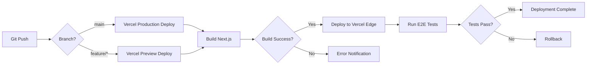

# デプロイ計画書

## 1. デプロイメント概要

### 1.1 デプロイ先
- **フロントエンド**: Vercel（Next.js ホスティング）
- **データベース**: Supabase（PostgreSQL）
- **ストレージ**: Supabase Storage（画像ファイル）
- **CDN**: Cloudflare（DNS + CDN）

### 1.2 環境構成
| 環境 | URL | Git ブランチ | 用途 |
|------|-----|--------------|------|
| **Production** | `https://fukuoka-stage.com` | `main` | 本番環境 |
| **Preview** | `https://fukuoka-stage-*.vercel.app` | `feature/*` | PR毎のプレビュー環境 |
| **Development** | `http://localhost:3000` | ローカル | 開発環境 |

---

## 2. 初期セットアップ手順

### 2.1 前提条件
- [x] GitHub アカウント
- [x] Vercel アカウント
- [x] Supabase アカウント
- [x] Google AI Studio アカウント（Gemini API）
- [x] Cloudflare アカウント（ドメイン管理）
- [x] ドメイン取得済み（`fukuoka-stage.com`）

---

### 2.2 GitHubリポジトリ作成

#### Step 1: リポジトリ作成
```bash
cd /Users/nishiyamaakihiro/Desktop/Portal\ site/fukuoka-stage---night's-coffee
git init
git add .
git commit -m "Initial commit: Next.js 15 project setup

Co-Authored-By: Claude Sonnet 4.5 <noreply@anthropic.com>"
```

#### Step 2: GitHub リモートリポジトリに接続
```bash
# GitHubで新しいリポジトリを作成（fukuoka-stage）
git remote add origin https://github.com/[username]/fukuoka-stage.git
git branch -M main
git push -u origin main
```

---

### 2.3 Supabase プロジェクト作成

#### Step 1: プロジェクト作成
1. [Supabase Dashboard](https://app.supabase.com/) にログイン
2. 「New Project」をクリック
3. プロジェクト情報を入力:
   - **Name**: `fukuoka-stage`
   - **Database Password**: 強力なパスワード（保存必須）
   - **Region**: `Northeast Asia (Tokyo)` or `Southeast Asia (Singapore)`
   - **Pricing Plan**: **Free** (初期は無料プラン)

#### Step 2: データベース初期化
1. Supabase Dashboard → **SQL Editor**
2. 以下のマイグレーションスクリプトを実行:

```sql
-- docs/03_database.md の Migration Scripts を参照
-- supabase/migrations/001_initial_schema.sql
-- supabase/migrations/002_updated_at_trigger.sql
-- supabase/migrations/003_fulltext_search.sql
```

#### Step 3: APIキー取得
1. **Settings** → **API**
2. 以下をコピー:
   - `Project URL`（例: `https://xxx.supabase.co`）
   - `anon public` key
   - `service_role` key（秘密鍵、サーバーサイドのみ使用）

---

### 2.4 Google AI Studio（Gemini API）セットアップ

#### Step 1: APIキー取得
1. [Google AI Studio](https://aistudio.google.com/) にアクセス
2. 「Get API Key」をクリック
3. 新しいAPIキーを作成
4. キーをコピー（`AIzaSyxxx...`）

#### Step 2: 課金設定（従量課金）
1. Google Cloud Console → **Billing**
2. クレジットカード登録
3. Gemini APIの課金を有効化

---

### 2.5 Vercel プロジェクト作成

#### Step 1: プロジェクトインポート
1. [Vercel Dashboard](https://vercel.com/dashboard) にログイン
2. 「Add New」→「Project」
3. **Import Git Repository**:
   - GitHub リポジトリを選択（`fukuoka-stage`）
   - **Framework Preset**: Next.js
   - **Root Directory**: `./` （デフォルト）

#### Step 2: 環境変数設定
Vercel Dashboard → **Settings** → **Environment Variables** で以下を設定:

##### Production 環境変数
```bash
# Supabase
NEXT_PUBLIC_SUPABASE_URL=https://xxx.supabase.co
NEXT_PUBLIC_SUPABASE_ANON_KEY=eyJxxx...
SUPABASE_SERVICE_ROLE_KEY=eyJxxx...

# Gemini API
GEMINI_API_KEY=AIzaSyxxx...

# reCAPTCHA
RECAPTCHA_SITE_KEY=xxx...
RECAPTCHA_SECRET_KEY=xxx...

# Contact (Resend)
RESEND_API_KEY=re_...
CONTACT_TO_EMAIL=contact@example.com
CONTACT_FROM_EMAIL=Fukuoka Stage <no-reply@example.com>

# TinaCMS
TINA_TOKEN=xxx...
NEXT_PUBLIC_TINA_CLIENT_ID=xxx...

# Site URL
NEXT_PUBLIC_SITE_URL=https://fukuoka-stage.com
```

#### Step 3: デプロイ
1. 「Deploy」ボタンをクリック
2. ビルドが自動開始（1-3分）
3. デプロイ完了 → `https://fukuoka-stage.vercel.app`

---

### 2.6 TinaCMS セットアップ

#### Step 1: TinaCMS Cloudアカウント作成
1. [TinaCMS Cloud](https://app.tina.io/) にアクセス
2. GitHubアカウントでサインアップ
3. プロジェクト作成:
   - **Project Name**: `fukuoka-stage`
   - **Repository**: `[username]/fukuoka-stage`

#### Step 2: Client ID 取得
1. TinaCMS Dashboard → **Settings** → **Client ID**
2. `NEXT_PUBLIC_TINA_CLIENT_ID` をコピー

#### Step 3: Read-Only Token 取得
1. TinaCMS Dashboard → **Tokens**
2. 「Create Read-Only Token」をクリック
3. `TINA_TOKEN` をコピー
4. Vercel環境変数に追加

---

### 2.7 Cloudflare DNS設定

#### Step 1: ドメインをCloudflareに追加
1. [Cloudflare Dashboard](https://dash.cloudflare.com/) にログイン
2. 「Add a Site」→ `fukuoka-stage.com` を入力
3. Freeプランを選択
4. ネームサーバーを変更（ドメイン registrar で設定）

#### Step 2: DNS レコード設定
| Type | Name | Content | Proxy |
|------|------|---------|-------|
| **CNAME** | `@` | `cname.vercel-dns.com` | ✅ Proxied |
| **CNAME** | `www` | `cname.vercel-dns.com` | ✅ Proxied |

#### Step 3: SSL/TLS設定
1. Cloudflare → **SSL/TLS** → **Overview**
2. **Full (strict)** を選択

---

### 2.8 Vercel カスタムドメイン設定

#### Step 1: ドメイン追加
1. Vercel Dashboard → **Settings** → **Domains**
2. 「Add Domain」
   - `fukuoka-stage.com`
   - `www.fukuoka-stage.com`

#### Step 2: DNS確認
Vercel が自動的に DNS を検証（1-5分）

#### Step 3: SSL証明書自動発行
Vercel が Let's Encrypt で SSL 証明書を自動発行（5-10分）

---

## 3. CI/CD パイプライン

### 3.1 自動デプロイフロー



---

### 3.2 GitHub Actions ワークフロー

#### `.github/workflows/ci.yml`

```yaml
name: CI

on:
  pull_request:
    branches: [main]
  push:
    branches: [main]

jobs:
  lint:
    runs-on: ubuntu-latest
    steps:
      - uses: actions/checkout@v4
      - uses: actions/setup-node@v4
        with:
          node-version: '20'
          cache: 'npm'
      - run: npm ci
      - run: npm run lint

  type-check:
    runs-on: ubuntu-latest
    steps:
      - uses: actions/checkout@v4
      - uses: actions/setup-node@v4
        with:
          node-version: '20'
          cache: 'npm'
      - run: npm ci
      - run: npm run type-check

  build:
    runs-on: ubuntu-latest
    steps:
      - uses: actions/checkout@v4
      - uses: actions/setup-node@v4
        with:
          node-version: '20'
          cache: 'npm'
      - run: npm ci
      - run: npm run build
        env:
          NEXT_PUBLIC_SUPABASE_URL: ${{ secrets.NEXT_PUBLIC_SUPABASE_URL }}
          NEXT_PUBLIC_SUPABASE_ANON_KEY: ${{ secrets.NEXT_PUBLIC_SUPABASE_ANON_KEY }}
```

---

### 3.3 Vercel 自動デプロイ設定

Vercel は GitHub と連携し、以下のイベントで自動デプロイ:

| イベント | デプロイ先 | URL |
|----------|-----------|-----|
| `main` ブランチへの Push | **Production** | `https://fukuoka-stage.com` |
| PR 作成/更新 | **Preview** | `https://fukuoka-stage-git-[branch]-[username].vercel.app` |

**自動ビルド設定**:
```json
{
  "buildCommand": "npm run build",
  "outputDirectory": ".next",
  "installCommand": "npm ci",
  "framework": "nextjs"
}
```

---

## 4. 環境変数管理

### 4.1 ローカル開発（`.env.local`）

```bash
# Supabase
NEXT_PUBLIC_SUPABASE_URL=https://xxx.supabase.co
NEXT_PUBLIC_SUPABASE_ANON_KEY=eyJxxx...
SUPABASE_SERVICE_ROLE_KEY=eyJxxx...

# Gemini API
GEMINI_API_KEY=AIzaSyxxx...

# TinaCMS
TINA_TOKEN=xxx...
NEXT_PUBLIC_TINA_CLIENT_ID=xxx...

# Site URL
NEXT_PUBLIC_SITE_URL=http://localhost:3000
```

**重要**: `.env.local` は `.gitignore` に追加済み（コミットしない）

---

### 4.2 Vercel Production環境変数

Vercel Dashboard → **Settings** → **Environment Variables**:

| 変数名 | 値 | 環境 |
|--------|-----|------|
| `NEXT_PUBLIC_SUPABASE_URL` | `https://xxx.supabase.co` | Production, Preview |
| `NEXT_PUBLIC_SUPABASE_ANON_KEY` | `eyJxxx...` | Production, Preview |
| `SUPABASE_SERVICE_ROLE_KEY` | `eyJxxx...` | Production（秘密鍵） |
| `GEMINI_API_KEY` | `AIzaSyxxx...` | Production, Preview |
| `RECAPTCHA_SITE_KEY` | `xxx...` | Production, Preview |
| `RECAPTCHA_SECRET_KEY` | `xxx...` | Production, Preview |
| `RESEND_API_KEY` | `re_...` | Production, Preview |
| `CONTACT_TO_EMAIL` | `contact@example.com` | Production, Preview |
| `CONTACT_FROM_EMAIL` | `Fukuoka Stage <no-reply@example.com>` | Production, Preview |
| `TINA_TOKEN` | `xxx...` | Production, Preview |
| `NEXT_PUBLIC_TINA_CLIENT_ID` | `xxx...` | Production, Preview |
| `NEXT_PUBLIC_SITE_URL` | `https://fukuoka-stage.com` | Production |

---

## 5. デプロイ後の確認事項

### 5.1 動作確認チェックリスト

#### フロントエンド
- [ ] トップページが表示される（`https://fukuoka-stage.com`）
- [ ] 公演一覧ページが表示される（`/events/`）
- [ ] カレンダーページが表示される（`/calendar/`）
- [ ] ブログ一覧ページが表示される（`/blog/`）
- [ ] TinaCMS管理画面にアクセスできる（`/admin`）

#### データベース
- [ ] Supabaseに接続できる
- [ ] 公演データを取得できる
- [ ] RLSポリシーが正しく動作する

#### AI機能
- [ ] チラシ画像アップロードができる（`/register`）
- [ ] Gemini APIでチラシ解析ができる
- [ ] SNS宣伝文が生成される

#### SEO
- [ ] `robots.txt`が表示される（`/robots.txt`）
- [ ] `sitemap.xml`が表示される（`/sitemap.xml`）
- [ ] OGP画像が正しく表示される（Twitter Card Validator）
- [ ] 構造化データが正しい（Google Rich Results Test）

#### パフォーマンス
- [ ] PageSpeed Insights スコア 90点以上
- [ ] LCP < 2.5秒
- [ ] FID < 100ms
- [ ] CLS < 0.1

---

### 5.2 Google Search Console 登録

#### Step 1: プロパティ追加
1. [Google Search Console](https://search.google.com/search-console) にアクセス
2. 「プロパティを追加」
   - `https://fukuoka-stage.com`
   - `https://www.fukuoka-stage.com`

#### Step 2: 所有権確認
**方法A: HTML ファイルアップロード**
1. Google が提供する HTML ファイルをダウンロード
2. `public/` ディレクトリに配置
3. `git push` → Vercel デプロイ

**方法B: DNS レコード**
1. Google が提供する TXT レコードをコピー
2. Cloudflare → **DNS** → **Add Record**
3. Type: `TXT`, Name: `@`, Content: `google-site-verification=xxx`

#### Step 3: サイトマップ送信
1. Google Search Console → **サイトマップ**
2. 「新しいサイトマップの追加」
   - `https://fukuoka-stage.com/sitemap.xml`

---

### 5.3 Google Analytics 4 設定

#### Step 1: プロパティ作成
1. [Google Analytics](https://analytics.google.com/) にアクセス
2. 「プロパティを作成」
   - **プロパティ名**: `FUKUOKA STAGE`
   - **タイムゾーン**: 日本
   - **通貨**: JPY（日本円）

#### Step 2: データストリーム作成
1. 「データストリーム」→「ウェブ」
2. URL: `https://fukuoka-stage.com`
3. `測定ID`をコピー（例: `G-XXXXXXXXXX`）

#### Step 3: Next.jsに統合

**`app/layout.tsx`**:
```tsx
import { GoogleAnalytics } from '@next/third-parties/google';

export default function RootLayout({ children }: { children: React.ReactNode }) {
  return (
    <html lang="ja">
      <body>
        {children}
        <GoogleAnalytics gaId="G-XXXXXXXXXX" />
      </body>
    </html>
  );
}
```

---

## 6. 運用デプロイフロー

### 6.1 日常的なコンテンツ更新

#### ブログ記事追加（TinaCMS）
```bash
1. https://fukuoka-stage.com/admin にアクセス
2. ブログ記事を作成
3. 「Save」→ GitHub に自動コミット
4. Vercel が自動デプロイ（1-2分）
```

#### 公演情報追加（劇団ダッシュボード）
```bash
1. https://fukuoka-stage.com/register にアクセス（ログイン/オンボーディング）
2. 劇団承認が完了していない場合は「承認待ち」状態（公開は不可、下書き作成は可）
3. https://fukuoka-stage.com/theater にアクセス（劇団ダッシュボード）
4. 新規公演を作成（チラシ画像アップロード → AI自動解析 → 内容確認・修正）
5. 保存（draft / published / archived）
   - published は「劇団が承認済み」の場合のみ可能
6. category/slug を変更してURLが変わる場合は、旧URL→新URLの301が自動作成される前提
```

---

### 6.2 緊急ロールバック手順

#### Vercel でロールバック
1. Vercel Dashboard → **Deployments**
2. 正常動作していたデプロイを選択
3. 「Promote to Production」をクリック
4. 即座にロールバック完了（1分以内）

#### Git でロールバック
```bash
# 直前のコミットに戻す
git revert HEAD
git push origin main

# 特定のコミットに戻す
git revert abc1234
git push origin main
```

---

## 7. 監視・アラート

### 7.1 Vercel Analytics
- **リアルタイム監視**: ページ速度、エラー率、トラフィック
- **Core Web Vitals**: LCP, FID, CLS
- **アラート設定**: エラー率 > 5% でメール通知

### 7.2 Supabase Monitoring
- **Database Performance**: クエリ実行時間、接続数
- **Storage Usage**: 画像ファイル容量
- **API Requests**: API コール数（従量課金監視）

### 7.3 Uptime Monitoring（UptimeRobot）
- **URL**: `https://fukuoka-stage.com`
- **監視間隔**: 5分
- **アラート**: ダウン時にメール通知

---

## 8. バックアップ戦略

### 8.1 Supabase 自動バックアップ
- **Free プラン**: 7日間の自動バックアップ
- **Pro プラン**: 30日間の自動バックアップ
- **バックアップ頻度**: 日次（毎日 00:00 UTC）

### 8.2 Git バックアップ
- **すべてのコンテンツ**: Git でバージョン管理
- **TinaCMS記事**: `content/blog/*.md` で管理
- **コミット履歴**: 完全な変更履歴を保持

### 8.3 手動バックアップ（月次）
```bash
# Supabase データベースダンプ
supabase db dump -f backup_$(date +%Y%m%d).sql

# 重要テーブルのCSVエクスポート
# → docs/03_database.md 参照
```

---

## 9. セキュリティチェックリスト

### 9.1 デプロイ前
- [ ] `.env.local` が `.gitignore` に追加されている
- [ ] Supabase RLS ポリシーが正しく設定されている
- [ ] Gemini API キーが環境変数に設定されている
- [ ] Vercel環境変数が Production/Preview で分離されている

### 9.2 デプロイ後
- [ ] SSL/TLS証明書が有効（HTTPS）
- [ ] Cloudflare Proxy が有効（CDN + DDoS対策）
- [ ] Rate Limiting が設定されている（Vercel Middleware）
- [ ] CORS設定が正しい（Supabase）
- [ ] セキュリティヘッダーが設定されている（Next.js）

---

## 10. コスト管理

### 10.1 月次コスト監視

| サービス | 無料枠 | 超過時の従量課金 |
|----------|--------|------------------|
| **Vercel Pro** | 1TB帯域幅 | $0.12/GB |
| **Supabase Free** | 500MB DB, 1GB Storage | Proプラン: $25/月 |
| **TinaCMS Free** | 2ユーザー | Teamプラン: $29/月 |
| **Gemini API** | なし | Flash: $0.05-0.1/画像 |

### 10.2 コストアラート設定
- **Google Cloud**: Gemini API 使用量が $10/月 超過時にアラート
- **Vercel**: 帯域幅が 80% 超過時にアラート
- **Supabase**: DB容量が 400MB 超過時にアラート

---

**作成日**: 2026-01-31
**バージョン**: 1.0
**作成者**: Claude Code (AI Assistant)
